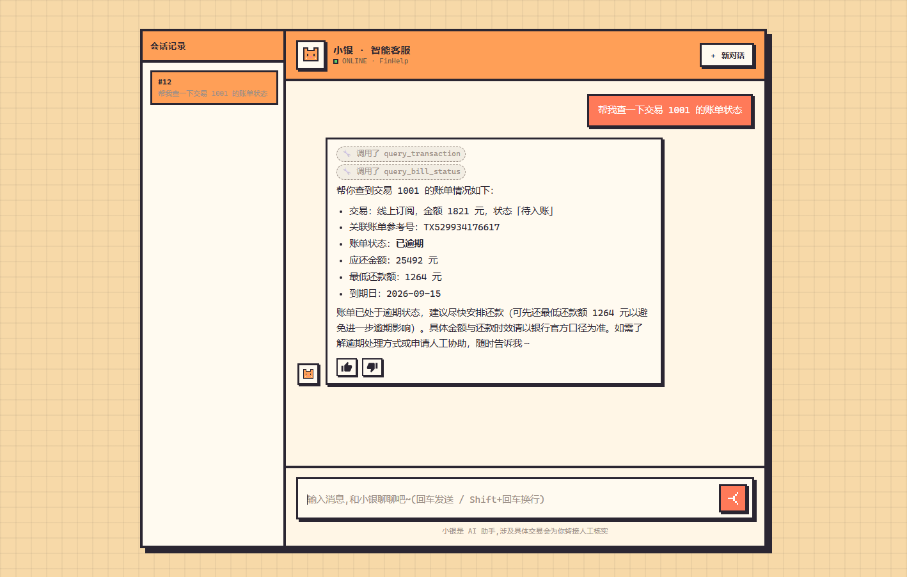
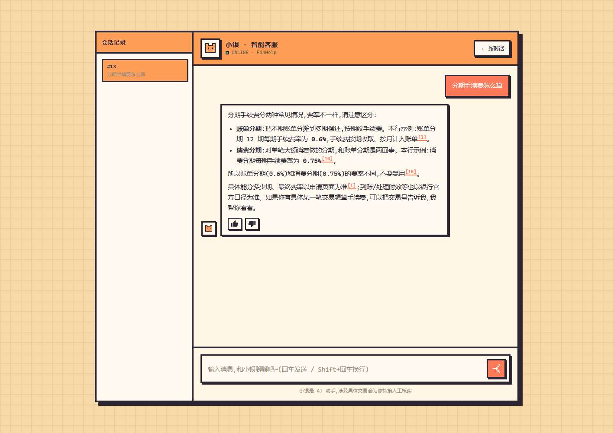
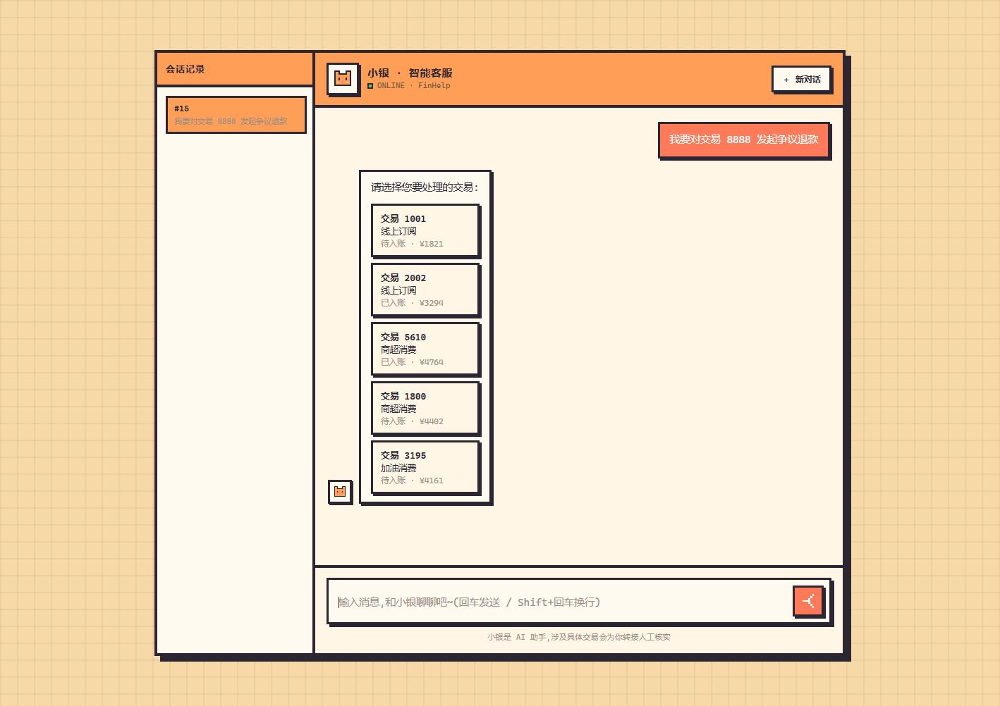
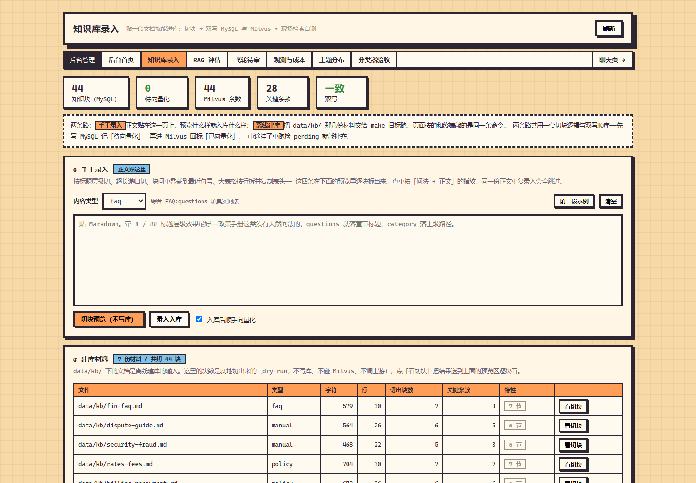
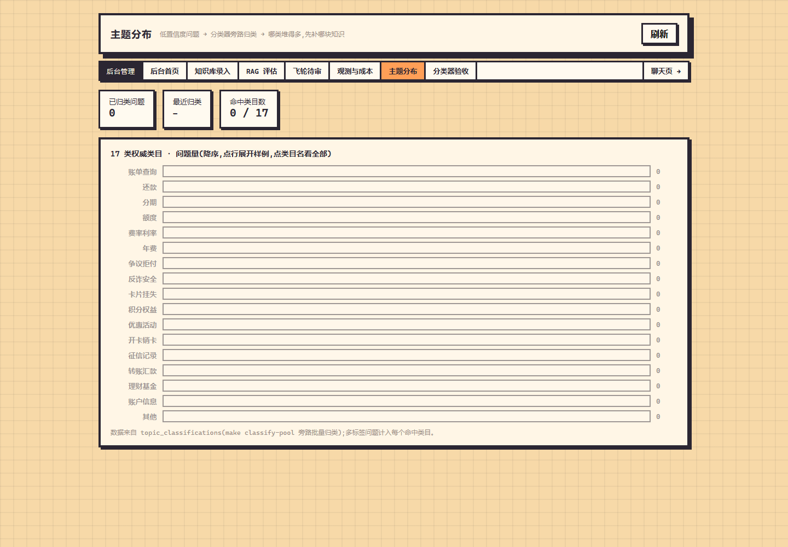
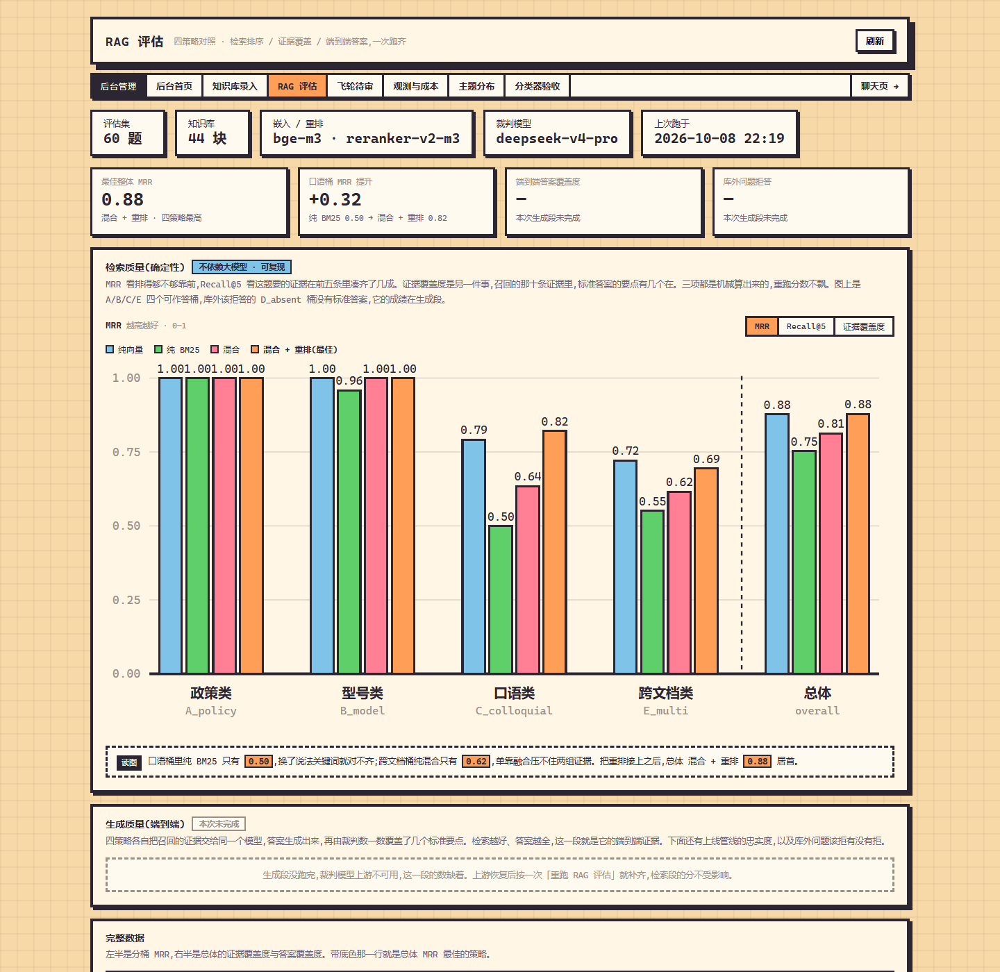

# FinHelp — 银行/信用卡智能客服 Agent

一个能查交易账单、答费率政策 FAQ、走争议申诉流程、挖知识补库、还能微调一个主题分类器的
**金融客服 Agent**。

## 界面速览

**聊天页** —— 一句话触发两步工具链（先 `query_transaction` 拿交易与账单参考号，再
`query_bill_status` 查账单），回答带金融合规免责语：



**知识路回答（带引用编号）** —— 政策类问题走向量检索，每个结论后标来源编号 `[1]`/`[10]`，
并且能正确区分易混的两档费率（账单分期 0.6% vs 消费分期 0.75%）：



**争议申诉的中断流程** —— 报一个不属于自己的交易号时，`fetch_order` 这个**确定性节点**
（不经工具调用）直接用 LangGraph 的 `interrupt` 弹出交易选择器，点选后再 `resume` 续跑：



**知识库录入** —— 7 篇金融文档切块 44 段、28 段关键条款，MySQL 与 Milvus 双写一致、
支持就地切块预览与现场检索自测：



**主题分布** —— ch10 主题分类器的 17 个金融类目（账单/还款/分期/额度/费率/年费/争议拒付/
反诈安全…），归并、多标签、计数与样例都在这一页：



**RAG 评估** —— 60 题金融评估集（政策类 / 精确类 / 口语类 / 跨文档类 / 库外拒答，
五桶各 12 题）上的四策略对照：纯 BM25 在口语桶掉到 0.50，混合 + 重排把短板补齐、
总体 MRR 0.88 居首：



## 业务域设计

- **意图体系**：9 意图 → 5 出口（与课程原版结构完全同构）
  账务查询 / 业务咨询 / 争议申诉 / 账务调整 / 卡片与安全 / 投诉 / 人工 / 闲聊 / 其他
- **知识库**：7 篇金融文档 —— 卡片账户、账单还款、费率计息、争议拒付、积分权益、安全反诈、综合FAQ（切块 44 段）
- **内置工具**：`query_transaction`（查交易）· `query_rate_policy`（查费率规则）·
  `submit_dispute`（发起争议申诉）· `create_ticket`（建人工工单）· `query_faq`（政策知识库检索）
- **MCP 工具**（两台独立进程）：
  `query_bill_status`（账务核心 :8101）· `query_risk_level` / `query_dispute_status`（风控与争议 :8102）
- **金融合规护栏**：不索要密码/验证码/完整卡号、不承诺收益、资金争议优先转人工、
  涉钱回答统一带「以银行官方口径为准」

## 技术栈

FastAPI + LangGraph / LangChain + SQLAlchemy / MySQL + Milvus。

聊天、嵌入、重排三组上游各自直连，没有网关那一层。模型名和地址都在 `.env` 里配
（`CHAT_*` / `EMBED_*` / `RERANK_*` 三组），换供应商、换模型不用改代码。

## 快速开始

```bash
cp .env.example .env                 # 填 CHAT_* / EMBED_* / RERANK_* 三组密钥
docker compose up -d                 # mysql / etcd / minio / milvus
make seed && make seed-conv          # 建表种子 + 合成对话
make kb-build && make kb-vectorize   # 金融知识库切块 + 向量化
make dev                             # 依赖容器 + MCP :8101/:8102 + 应用 :8000
```

浏览器打开 <http://localhost:8000> 就是聊天页。

### 两个踩过的环境坑

1. **MinIO 镜像**：官方 `minio/minio` 已从 Docker Hub 下架（拉取报 `unauthorized`），
   `docker-compose.yml` 已改用同源镜像站 `openebs/minio:RELEASE.2024-12-18T13-15-44Z`
   （entrypoint/cmd 与官方一致，含 curl/mc，可直接替换）。
2. **CHAT_MODEL**：实测 `deepseek-v4-flash` 走 `api.deepseek.com` 时 function calling
   通道严重不稳定（同一问句连测 8 次失败 5 次 —— 模型判对了，但把结果当正文吐出、
   不走 `tool_calls`，导致结构化输出解析失败、意图兜底成「其他」）；
   改用 `deepseek-v4-pro` 后同条件 **8 次全过**。

## 相对课程原版的改造范围

| 层 | 改动 |
|---|---|
| 意图体系 | 9 意图换金融语义（结构仍 9 → 5 出口） |
| 主题类目 | 17 类 → 金融 17 类（含边界说明 / 示例说法 / 严中宽容错档） |
| 工具层 | 5 个内置工具改名 + 两台 MCP Server 换成「账务核心」「风控与争议」 |
| 知识库 | 6 篇电商文档 → 7 篇金融文档 |
| 业务数据 | 订单/物流 mock → 交易/账单 mock（`merchant` / `bill_ref`） |
| 前端 | 12 个页面文案 + 争议表单字段 + 示例问句 |
| 数据与测试 | 评估数据文件、全量测试断言同步（**487 passed / 0 failed**） |

## 目录结构

| 位置 | 装的是什么 |
| - | - |
| `app/api/` | HTTP 入口。聊天、Agent、知识库录入、复核、验收页、成本看板 |
| `app/graph/` | LangGraph 那张图。`state` 状态、`nodes` 节点、`routing` 分流规则、`build` 组装 |
| `app/core/` | 单点能力。上游客户端、检索、重排、意图、指代、摘要、置信度、飞轮、可观测 |
| `app/kb/` | 知识怎么进库。切块、嵌入、双写 MySQL 与 Milvus、去重、从对话里挖问答对 |
| `app/tools/` | 工具系统。内置 `@tool`、MCP 客户端、注册表、统一执行引擎 |
| `app/static/` | 前端页面。聊天、知识库录入、飞轮待审、观测与成本、主题分布、分类器验收 |
| `mcp_servers/` | 两台账务与风控 MCP Server，独立进程，mock 数据 |
| `data/kb/` | 金融知识库 markdown（建库材料） |
| `sql/` | 建表 DDL 与种子数据，容器首启按文件名顺序自动执行 |
| `tests/` | 测试与评估数据 |
| `docs/` | 设计与改造文档 |

## 各章长出了什么，怎么验

`make test` 跑全部单测，不打真实模型。下面这些要真服务在跑。

| 章 | 这一章长出来的东西 | 验收 |
| - | - | - |
| ch01 | 流式对话、结构化提取 | `make eval` |
| ch02 | 五个 `@tool` 业务工具，单轮 Function Calling | `make eval-agent` |
| ch03 | 切块、嵌入、MySQL 与 Milvus 双写、对话挖知识 | `make kb-build` `make kb-vectorize` `make eval-retrieval` |
| ch04 | 混合检索、RRF、重排、Query 改写、四策略评估 | `make smoke-rag` `make eval-rag` |
| ch05 | LangGraph workflow 骨架 + 主力 Agent 的 ReAct 环 | `make eval-ch05` |
| ch06 | 分流器、指代消解、争议子流程的 interrupt/resume | `make smoke-interrupt` `make eval-ch06` |
| ch07 | 上下文管理。滑窗、摘要、前缀缓存 | `make eval-ch07` |
| ch08 | 工具系统。MCP 动态发现、统一执行引擎、审计日志 | `make eval-ch08` |
| ch09 | Langfuse 自部署、数据飞轮、成本账 | `make langfuse-up` `make flywheel` `make cost-report` |
| ch10 | 主题分类器。语料、微调、阈值扫描、ONNX 推理服务 | `make ch10-corpus` `make ch10-train` `make ch10-eval` |

## 端口

| 端口 | 是什么 |
| - | - |
| 8000 | 应用 |
| 8101 / 8102 | 业务 MCP Server，账务核心 / 风控与争议 |
| 8110 | ch10 主题分类器推理服务（`make classifier-up` 之后） |
| 3000 | Langfuse（`make langfuse-up` 之后） |
| 19530 | Milvus |

应用那几个页面：`/` 聊天、`/kb` 知识库录入、`/review` 飞轮待审、`/observability` 观测与成本、
`/topics` 主题分布、`/rag-eval` RAG 评估、`/acceptance` 分类器验收。

## 许可与使用

课程原版未附 LICENSE，本项目也**未重新授权**。仅供学习与个人研究；如需引用请注明来源
（小林coding《AI Agent 智能客服实战》配套源码 MewHelp）。
